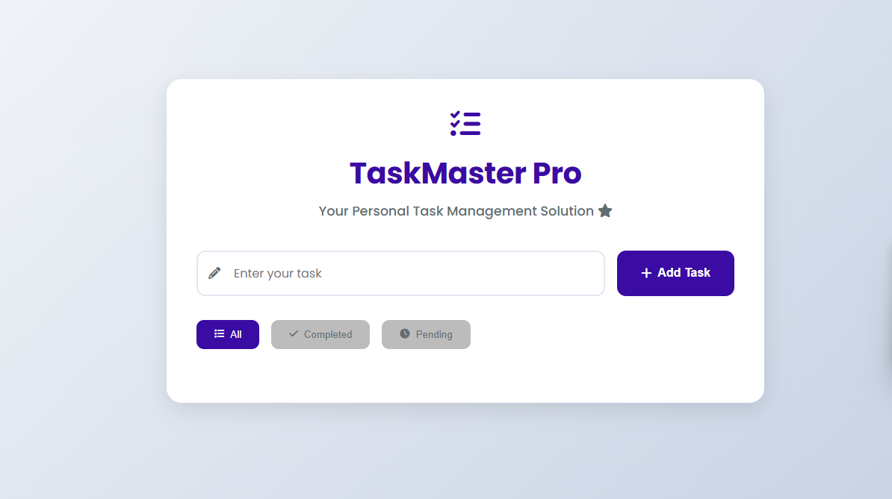
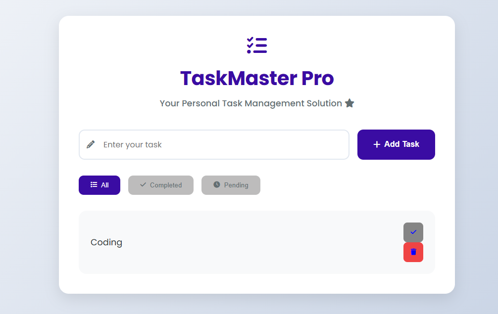

# TaskManager-Pro

A simple Todo List application built using **Vanilla JavaScript**, **HTML**, **CSS**, and **localStorage**.  
It allows you to **add, delete, complete, and filter** tasks. Your todos are saved in the browser so they remain even after refresh.

---

## Features

- Add new todos
- Mark todos as completed / pending
- Delete todos
- Filter by: All / Completed / Pending
- Save todos permanently using localStorage
- Responsive and easy-to-use UI

---

## Screenshot




## Concepts Used

- **JavaScript**: Variables, arrays, objects, boolean toggle, template literals, conditional statements
- **DOM Manipulation**: `getElementById`, `querySelectorAll`, `createElement`, `appendChild`, `innerHTML`, `classList`
- **Event Handling**: `addEventListener` for clicks and keyboard events
- **LocalStorage**: Save and retrieve todos
- **Array Methods**: `push`, `splice`, `filter`, `forEach`
- **Data Attributes**: `data-index` to link buttons to todos
- **Dynamic UI Rendering**: Rebuilding the todo list whenever data changes
- **Keyboard Support**: Press Enter to add a todo

---

## Usage

1. Clone the repository:
```bash
git clone https://github.com/yourusername/todo-app-js.git
